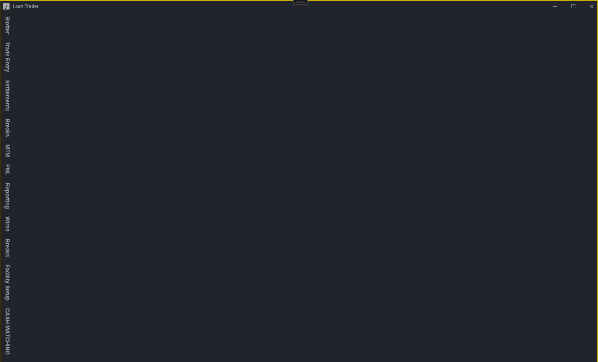
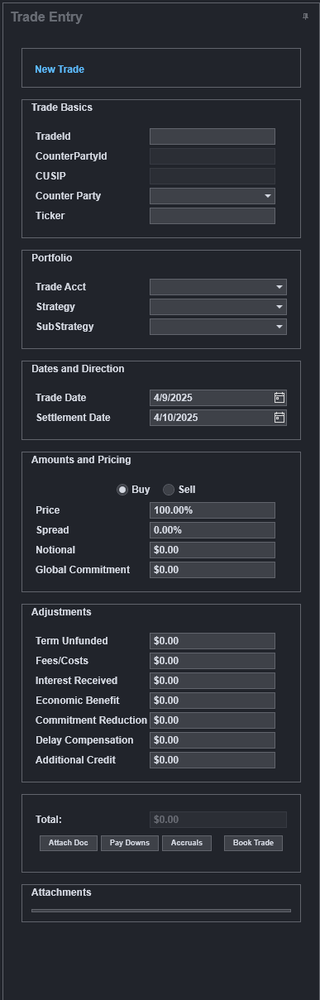
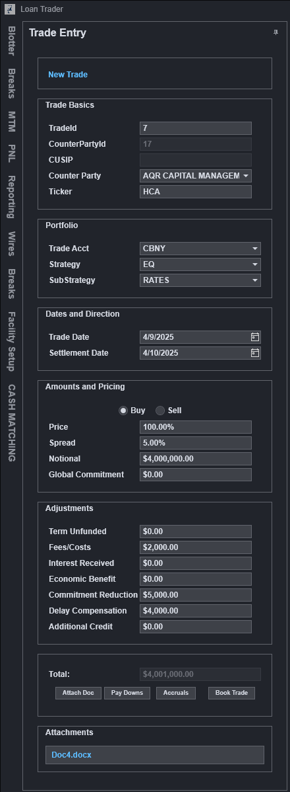
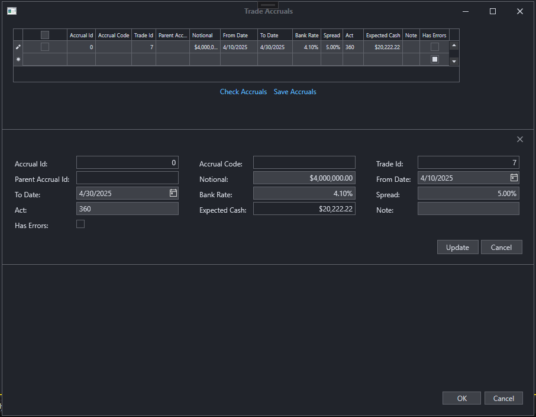
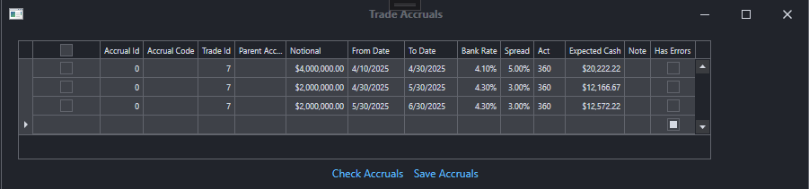

[](https://www.linkedin.com/in/michael-v-5961689/)

# OMS.Loans – WPF Loan Trade Management System (On-going)

This is a demo for a future pet project **Order Management System (OMS)** for **Loan Trade Entry**, built using **WPF (.NET 8)** with a modular MVVM architecture. It showcases key enterprise design patterns, component separation, and UI responsiveness using **DevExpress**, **AutoMapper**, and **MVVM Toolkit**.
Currently built out first phase which is to capture Blottered. Trades.
This OMS should have Blotter to Trade. Trade Allocation. Events management(paydowns,drawdowns accruals, cash). Lastly it will have a module to match incoming cash with events. 


## 📸 UI Preview





   -------->  

Here’s a screenshot of the blotter view with DevExpress GridControl and trade entry fields:

The screen is a view composed of two other views a form for trade entry and a grid in a seperate view for blottered trade look up. The form has validation built in. It will not allow user to push trades with missing or wrong fields. 
The grid is searchable. It also allows user to easily book and replicate a blottered trade. Simply highlight a row and grid fills with trade data. 


## 🧾 Accrual Entry Flow

**Accrual Entry**  


⬇️

**Accrual Entered**  


⬇️

**Accrual Saved**  


Deploy migration: simply change CONNECTION STRING in LoanDBContext.cs
protected override void OnConfiguring(DbContextOptionsBuilder options)
=> options.UseSqlServer(@"Data Source=YOUR_SERVER;User ID=YOUR_USER;Password=YOUR_PASSWORD;Initial Catalog=Oms;TrustServerCertificate=true;MultipleActiveResultSets=True;Max Pool Size=100;")


in project dir run 
   dotnet-ef migrations add InitialMigration
   


Absolutely — here’s the updated section for your `README.md`, with the **split functionality** included:

---

## 💵 Cash Matching Screen

The **Cash Matching** screen is used to reconcile **expected loan cash flows** (left panel) with **incoming external payments** (right panel). This tool allows operations or finance users to match cash movements effectively for audit, reporting, or settlement purposes.

### 🔄 Workflow Overview

- **Left Panel (Expected Cash)**  
  Displays anticipated loan cash flows from internal systems. Each row includes fields like `Code`, `Counter Party`, `Amount`, and `Expected Date`.

- **Right Panel (External Cash)**  
  Lists external payments received, including payment `Source`, `Amount`, `Date`, and associated metadata such as `Counter Party` and `Code`.

- **Middle Panel (Matched Records)**  
  This panel shows groups of matched cash flows. Users can:
  - Push items from the **Expected** and **External** panels into the middle.
  - Form matching groups where the **total of expected and received payments nets to zero**.
  - Visualize all components of a match in one place for easier review and validation.

### ✂️ Split Functionality

Users can **split incoming external payments into custom amounts** before matching. This allows flexibility when:

- A single incoming payment covers multiple expected items
- Payment amounts do not perfectly align with expected values
- Partial matches need to be reconciled over time

Split amounts appear as separate line items and can each be independently matched.

### 🎯 Key Features

- Manual and flexible matching using UI buttons or drag-and-drop
- Ability to split external cash into multiple matchable components
- Visual confirmation when match totals reach zero
- Automatic total calculation for matched groups
- Clear and intuitive three-panel layout

---

### 📸 Screenshot

Below is an example of the **Cash Matching** screen in use:


> _(Update the image path based on your actual folder structure)_

---

Let me know if you'd like to add keyboard shortcuts, backend reconciliation logic, or user role/access details as well.

---

## 🧰 Tech Stack

- **WPF (.NET 6)**
- **MVVM Toolkit** (`CommunityToolkit.Mvvm`)
- **DevExpress WPF UI Controls**
- **Entity Framework Core** (with migrations)
- **AutoMapper** (for ViewModel → Model mapping)
- **IoC/DI** (via .NET built-in container)
- **IDataErrorInfo** (validation support)
- **Message-based communication** (`ObservableRecipient`)

---

## 🗂️ Project Structure

### 📦 `LoanDbModel` (Class Library)
Encapsulates EF Core entities and DB context.

- **Entities:**
  - `Blotter.cs`
  - `Trade.cs`
  - `Cash.cs`
  - `CounterParty.cs`
  - `Accrual.cs`
  - `Paydown.cs`

- **EF Core Context & Migrations:**
  - `LoanDbContext.cs`
  - `/Migrations` folder contains all schema snapshots and updates

---

### 🖥️ `OMS.Loans` (WPF UI Project)

#### 🧩 Common
- Shared interfaces like `IBlotterEntries`, `ICounterParties`

#### 🔧 Mapping
- `MappingProfile.cs` – AutoMapper configuration for entity ↔ ViewModel transformations

#### 💬 Message
- MVVM messaging:
  - `BlotteredTradeSelected.cs`
  - `TradeBlotteredMessage.cs`

#### 🧪 Services
- `BlotterEntriesService.cs` – Service to manage blotter-related logic
- `CounterPartyService.cs` – Handles lookup and reference data

#### 🧠 ViewModels
Implements `ObservableRecipient`, validation (`IDataErrorInfo`), and MVVM logic.

- `BlotterEntriesViewModel.cs`
- `BlotterItem.cs` – Per-row VM
- `BlotterViewModel.cs`
- `MainViewModel.cs`

#### 🪟 Views
MVVM-bound XAML UI components using DevExpress controls.

- `BlotterEntriesView.xaml`
- `BlotterEntryView.xaml`
- `BlotterView.xaml`
- `MainWindow.xaml`

---

## 🚀 Features

- **Loan Trade Entry UI** with multi-field validation
- **Blotter view** showing trades using DevExpress grid
- **Real-time messaging** between components (selected trade messages, etc.)
- **Validation** using `IDataErrorInfo` per field
- **AutoMapper** mappings from DB entities to UI ViewModels
- **MVVM-first** with testable service and VM layers
- **Extensible architecture** for adding new trade types or UI modules

---

## 🔄 Getting Started

1. **Clone the repository**

   ```bash
   git clone <your-bitbucket-repo-url>
