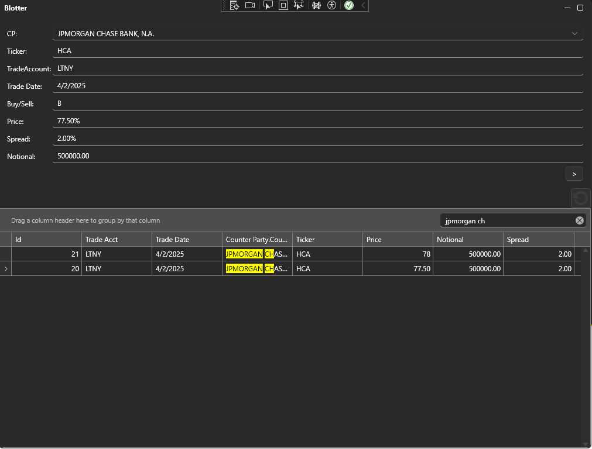
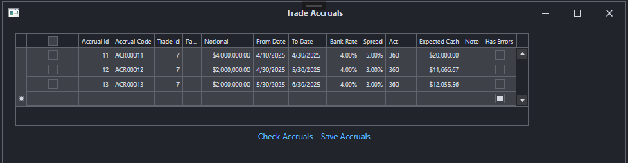
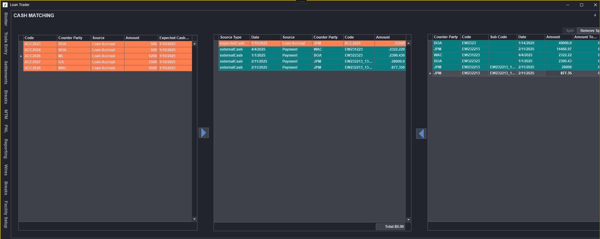

[](https://www.linkedin.com/in/michael-v-5961689/)
[](https://dotnet.microsoft.com/)
[](LICENSE)
[](https://github.com/m-vaysman/omsloans/issues)
[](https://github.com/m-vaysman/omsloans/commits)

# OMS.Loans — Syndicated Loan Order Management & Notice Extraction

Trading and operations tooling for **syndicated loans**, in two parts:

- **A notice extraction pipeline** — agent banks send PDF notices containing rate resets,
  interest and principal payments and fees. The aim is to ingest them, extract the economic
  data using LLM APIs, preserve full provenance, and put every extraction through human review
  before approval. Ingestion and the storage model are in; extraction and review are not.
- **A WPF desktop trading and operations application** — blotter, trade entry, accruals and
  paydowns, and a cash matching screen intended to reconcile expected loan cash flows against
  incoming wires.

Both are .NET 8 over SQL Server with Entity Framework Core. They share a product area, not one
database — the desktop application and the pipeline have separate models today.

## Status

**As of 2026-09-09.** Two tracks. They share a product area, not one database yet.

| Track | State | What that means |
| --- | --- | --- |
| WPF desktop OMS | Working local app | Blotter, trade entry, accruals. Cash-matching UI exists; matching logic is still thin. Needs a DevExpress licence to build. |
| Notice pipeline | Foundation + folder ingestion | Domain, EF migrations, unit tests, Windows Service host, watched-folder ingest. No extractor yet. React app is still the Vite scaffold. |

Progress lives in [issues](https://github.com/m-vaysman/omsloans/issues) against five
milestones. A closed issue is the unit of done — not a README adjective.

| Milestone | Now | Next ticket |
| --- | --- | --- |
| [Foundation](https://github.com/m-vaysman/omsloans/milestone/1) | Domain, migrations, tests, service host | Deal/Facility master data |
| [Ingestion](https://github.com/m-vaysman/omsloans/milestone/2) | Watched folder → `Notice` row, fail-closed startup | `.pdf` extension rule, mailbox, manual upload |
| [Extraction](https://github.com/m-vaysman/omsloans/milestone/3) | Seam, prompt + schema, and the three providers | The writer that persists `Extraction` rows, and the orchestration that calls a provider |
| [Review UI](https://github.com/m-vaysman/omsloans/milestone/4) | API host can serve a SPA; UI not built | App shell, queue, side-by-side review |
| [Ops](https://github.com/m-vaysman/omsloans/milestone/5) | Not started | Reprocess, accuracy report, logging/alerting |

How work moves: issue → branch → review (mine, then adversarial) → `release` → `main`.

---

## Notice extraction pipeline

Agent banks send notices as PDFs. The economic data in them — the reset rate, the accrued
interest, the payment date — has to reach loan operations accurately, and a misread rate is a
real operational error. The pipeline is built around that risk.

```
 watched folder [SHIPPED] ─┐
 shared mailbox [NOT YET] ─┼─► Notice (PDF stored verbatim, SHA-256 dedup)
 manual upload  [NOT YET] ─┘        │
                                    ▼
                        extract → events[] (Claude / OpenAI / Groq)   [BUILT, NOT YET CALLED]
                                    │
                                    ▼
                        Extraction (raw model JSON, append-only)   [TABLES EXIST, NO WRITER]
                                    │
                                    ▼
                        human review → approve / correct   [NOT YET]
```

### The decisions that shape it

Recorded as ADRs in [`docs/decisions/`](docs/decisions):

**[Cloud LLM APIs behind an interface](docs/decisions/0001-cloud-llm-over-local.md).** The
decision — not yet the code — is that Claude, OpenAI and Groq will sit behind a single
`INoticeExtractor`, so the provider is a configuration value rather than a code path. Claude
accepts PDFs natively, which matters because these documents are tabular — a rate reset table flattened to text loses the association between a
tranche and its rate.

**[A Windows Service, not a desktop app](docs/decisions/0002-windows-service-over-desktop.md).**
Notices arrive overnight and at weekends. Ingestion runs unattended so the work is already
waiting when a reviewer opens the queue.

**[Append-only extractions, corrections stored alongside](docs/decisions/0003-append-only-extractions-and-eav-fields.md).**
A reviewer's correction never overwrites what the model said — it is written beside it. That
pairing turns routine review into a labelled dataset, which is what makes model and prompt
accuracy measurable instead of a matter of impression. Reprocessing inserts a new row rather
than updating one, so a prompt change can be compared against the same notice.

### Repository layout for this half

| Path | |
| --- | --- |
| [`src/OmsLoan.Domain`](src/OmsLoan.Domain) | Entities, EF Core configuration, migrations |
| [`src/OmsLoan.Infrastructure`](src/OmsLoan.Infrastructure) | The provider implementations — one extractor over `IChatClient`, and the packages that carry it |
| [`src/OmsLoan.Worker`](src/OmsLoan.Worker) | Windows Service host — ingestion and extraction |
| [`src/OmsLoan.Api`](src/OmsLoan.Api) | Self-hosted Kestrel Windows Service — can serve a SPA from its own `wwwroot`; the review API is not built |
| [`src/OmsLoan.Web`](src/OmsLoan.Web) | Vite + React scaffold — the review UI itself is not built |
| [`tests/OmsLoan.Domain.Tests`](tests/OmsLoan.Domain.Tests) | Domain unit tests — no database required |
| [`scripts/prompts`](scripts/prompts) | Extraction prompts, vision and text variants |
| [`scripts/Notices`](scripts/Notices) | Generated sample notices for testing extraction |
| [`tools`](tools) | Development scripts, including the notice corpus generator — mock PDFs paired with the extraction each should produce |
| [`docs/windows-service.md`](docs/windows-service.md) | Worker service — account, ACLs, SQL login, configuration |
| [`docs/api-windows-service.md`](docs/api-windows-service.md) | Api service — Kestrel URLs and port binding, serving the React build |
| [`docs/extraction-fields.md`](docs/extraction-fields.md) | The extraction prompt, the field-name convention, and what is never extracted |

The domain tests build the EF model through the SQL Server provider without opening a
connection, so the suite runs on a clean clone with no database, no LocalDB and no container.

---

## Desktop application

Built with **WPF (.NET 8)** on a modular MVVM architecture, using **DevExpress**,
**AutoMapper** and the **MVVM Toolkit**.


### Trade entry and blotter

Trade entry and blotter lookup are two views composed into one screen. The form validates per
field and will not submit a trade with missing or invalid values. The grid is searchable, and
selecting a row fills the form — which makes replicating a blottered trade a single click.

 ➜ 



### Accrual entry


⬇️


⬇️



### Cash matching

Reconciles **expected loan cash flows** against **incoming external payments**. Expected cash
is generated from a trade's settlement date, a paydown's expected date, or an interest
accrual's end date; once those dates are reached the UI pulls the items from the back end. The
external grid can subscribe to a real-time wire service to present incoming payments.



Three panels: expected cash on the left, external payments on the right, and matched groups in
the middle. Users push items into the middle to form a group, and a group is complete when the
expected and received amounts net to zero.

Incoming payments can be **split into custom amounts** before matching — for when one wire
covers several expected items, when amounts do not align exactly, or when a partial match has
to be reconciled over time. Each split appears as its own line and is matched independently.

- Manual matching via buttons or drag-and-drop
- Visual confirmation when a group's total reaches zero
- Automatic totals per matched group

---

## Tech stack

| | |
| --- | --- |
| Runtime | .NET 8 |
| Desktop | WPF, DevExpress WPF, CommunityToolkit.Mvvm, AutoMapper |
| Services | Worker Service (Windows Service), ASP.NET Core |
| Web | React, TypeScript, Vite |
| Data | Entity Framework Core, SQL Server 2019 |
| Extraction | Planned — Claude, OpenAI and Groq APIs behind `INoticeExtractor` (not built) |
| Testing | xUnit |

---

## Getting started

```bash
git clone https://github.com/m-vaysman/omsloans.git
```

**Prerequisites**

- .NET 8 SDK
- SQL Server (LocalDB, Express or a full instance)
- Visual Studio 2022, Rider, or any C# IDE
- A DevExpress WPF subscription — required for the desktop application only, see
  *Third-party components* below

**Configure the connection string.** Values in the repository are placeholders. Supply the
real one through an environment variable, .NET user secrets, or a gitignored local config
file — see [SETUP.md](SETUP.md).

**Configure the extraction secrets.** The Worker reads flat environment variables, so a
machine that already has them set needs nothing further. Committed placeholders are always
empty:

| Purpose | Variable |
| --- | --- |
| Claude / OpenAI / Groq | `CLAUDE_API_KEY`, `OPEN_API_KEY`, `GROQ_API_KEY` |
| Microsoft Graph | `GRAPH_TENANT_ID`, `GRAPH_CLIENT_ID`, `GRAPH_CLIENT_SECRET` |

`OPEN_API_KEY` is the correct spelling — not `OPENAI_API_KEY`. The Worker's startup banner
reports which of these it found and from where, never their values.

**The Worker will not start without the database connection string, the watched folder, or
all three Graph variables** — without them it can neither collect a notice nor record one, and a service that
starts anyway looks healthy while ingesting nothing. It reports which are missing and stops,
without retrying: a missing variable is not fixed by restarting. The provider API keys stay
optional. The watched folder and its `processed\` / `failed\` subfolders are
created on startup if missing, and the service refuses to start unless it can read and write
there — an existing folder is left untouched. Details in
[`docs/windows-service.md`](docs/windows-service.md#required-and-what-happens-when-they-are-not-set).

**Create the database**

```bash
dotnet ef database update --project LoanDbModel
```

**Run the desktop application**

```bash
dotnet run --project OMS.Loans
```

**Run the extraction domain tests** — needs no database:

```bash
dotnet test tests/OmsLoan.Domain.Tests
```

**Run the API and web scaffold** — two processes in development, one in production:

```bash
dotnet run --project src/OmsLoan.Api          # Kestrel on :5023, Swagger at /swagger
npm --prefix src/OmsLoan.Web run dev          # Vite on :5173, proxying /api to the above
```

### Deployment

The pipeline deploys as **two Windows Services over one database**, neither depending on the
other — see [ADR 0002](docs/decisions/0002-windows-service-over-desktop.md).

| Service | Project | Covered by |
| --- | --- | --- |
| `OmsLoanWorker` | `src/OmsLoan.Worker` | [`docs/windows-service.md`](docs/windows-service.md) |
| `OmsLoanApi` | `src/OmsLoan.Api` | [`docs/api-windows-service.md`](docs/api-windows-service.md) |

Both self-host — no IIS — and both are registered Automatic (Delayed Start) with restart-on-
failure backoff, so a reboot or a crash brings each back without anyone logging on. The Api
publishes the web build into its own `wwwroot` and serves it from the same process, so
production is one port and one URL — the mechanism works; what it serves is still the
scaffold. Install, uninstall and lifecycle scripts for both are in
[`scripts/`](scripts).

---

## Third-party components

This project references **DevExpress WPF 24.2.6**, commercial software requiring a separate
paid licence. DevExpress assemblies are **not** included here — they are restored from the
DevExpress NuGet feed at build time, so building the desktop application requires an active
subscription and access to that feed. The extraction pipeline under `src/` does not depend on
DevExpress and builds without it.

Other dependencies — Entity Framework Core, AutoMapper, CommunityToolkit.Mvvm, QuestPDF,
xUnit — are restored from nuget.org under their own licences.

The licence below applies **only to the original source code in this repository**, not to
DevExpress or any other third-party package.

---

## Licence

Released under the [MIT License](LICENSE). Copyright © 2025–2026 Michael Vaysman.
